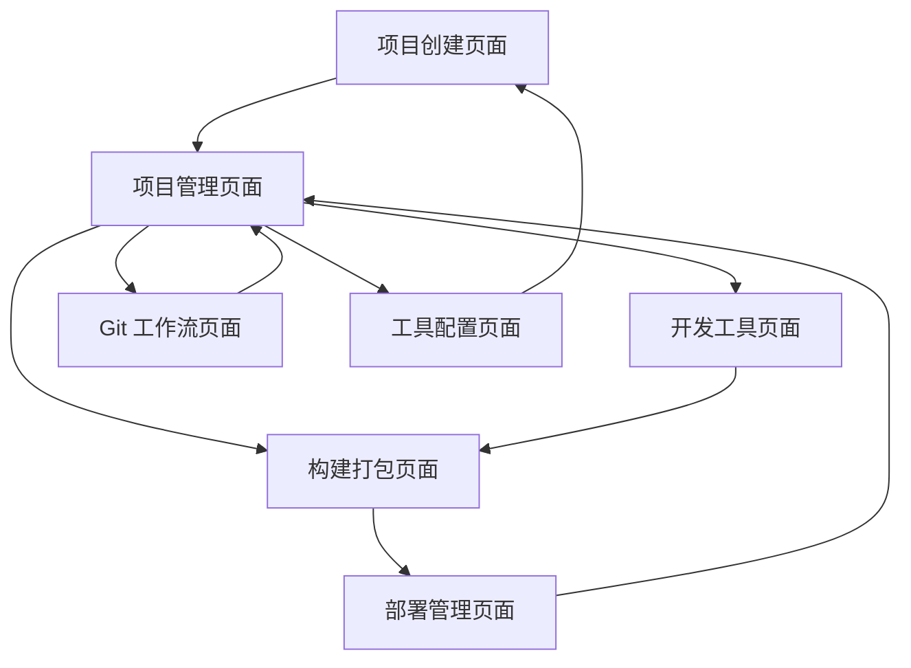

# LDesign 多功能脚手架工具产品需求文档

## 1. 产品概述

LDesign 是一个集成了 CLI 脚手架、开发工具链和可视化界面的多功能开发工具，旨在为前端开发者提供一站式的项目创建、开发、构建和部署解决方案。

该工具通过统一的命令行接口和直观的图形化界面，简化了 Vue、React、TypeScript、Node.js 等多种技术栈项目的创建和管理流程，显著提升开发效率。

产品目标是成为前端开发生态中的核心工具，支持从项目初始化到生产部署的完整开发周期。

## 2. 核心功能

### 2.1 用户角色

| 角色 | 使用方式 | 核心权限 |
|------|----------|----------|
| 开发者 | CLI 命令行或 UI 界面 | 创建项目、执行构建、管理工作流、部署项目 |

### 2.2 功能模块

本脚手架工具包含以下核心页面：

1. **项目创建页面**：项目模板选择、配置定制、快速初始化
2. **项目管理页面**：项目列表、状态监控、批量操作
3. **开发工具页面**：启动服务、实时预览、热重载管理
4. **构建打包页面**：多环境构建、产物管理、性能分析
5. **Git 工作流页面**：版本控制、分支管理、提交历史
6. **部署管理页面**：部署配置、环境管理、发布流程
7. **工具配置页面**：全局设置、模板管理、插件配置

### 2.3 页面详情

| 页面名称 | 模块名称 | 功能描述 |
|----------|----------|----------|
| 项目创建页面 | 模板选择器 | 提供 Vue2/Vue3、React、TypeScript、Less、Node.js 等项目模板选择 |
| 项目创建页面 | 配置向导 | 引导用户配置项目名称、技术栈、构建工具等选项 |
| 项目创建页面 | 快速初始化 | 一键创建项目并安装依赖，支持 pnpm 包管理 |
| 项目管理页面 | 项目列表 | 显示所有创建的项目，支持搜索、筛选和排序 |
| 项目管理页面 | 状态监控 | 实时显示项目运行状态、构建状态和部署状态 |
| 项目管理页面 | 批量操作 | 支持批量启动、停止、构建多个项目 |
| 开发工具页面 | 服务管理 | 启动、停止、重启开发服务器，支持 Vite 热重载 |
| 开发工具页面 | 实时预览 | 内嵌浏览器预览项目，支持多设备尺寸模拟 |
| 开发工具页面 | 日志查看 | 实时显示开发服务器日志和错误信息 |
| 构建打包页面 | 构建配置 | 配置开发、测试、生产等多环境构建参数 |
| 构建打包页面 | 打包执行 | 执行 Vite、Rollup、tsup 等构建工具进行项目打包 |
| 构建打包页面 | 产物分析 | 分析构建产物大小、依赖关系和性能指标 |
| Git 工作流页面 | 版本控制 | 集成 Git 基础操作：add、commit、push、pull |
| Git 工作流页面 | 分支管理 | 创建、切换、合并、删除分支，可视化分支图 |
| Git 工作流页面 | 提交历史 | 查看提交记录、差异对比、回滚操作 |
| 部署管理页面 | 部署配置 | 配置部署目标、环境变量、构建脚本 |
| 部署管理页面 | 发布流程 | 自动化部署流程，支持多种部署平台 |
| 部署管理页面 | 环境管理 | 管理开发、测试、生产等多套部署环境 |
| 工具配置页面 | 全局设置 | 配置默认模板、构建工具、包管理器等全局选项 |
| 工具配置页面 | 模板管理 | 自定义项目模板、导入导出模板配置 |
| 工具配置页面 | 插件配置 | 管理 VSCode 插件集成和扩展功能 |

## 3. 核心流程

**主要用户操作流程：**

1. **项目创建流程**：用户进入项目创建页面 → 选择项目模板 → 配置项目参数 → 执行初始化 → 跳转到项目管理页面

2. **开发调试流程**：用户在项目管理页面选择项目 → 进入开发工具页面 → 启动开发服务器 → 实时预览和调试

3. **构建部署流程**：用户在开发工具页面完成开发 → 进入构建打包页面 → 执行构建 → 进入部署管理页面 → 配置并执行部署

4. **版本管理流程**：用户在任意页面 → 进入 Git 工作流页面 → 执行版本控制操作 → 返回原页面继续工作

## 4. 用户界面设计

### 4.1 设计风格

- **主色调**：#0052D9（TDesign 蓝色）、#F2F3FF（浅蓝背景）
- **辅助色**：#00A870（成功绿）、#E34D59（错误红）、#ED7B2F（警告橙）
- **按钮样式**：圆角矩形按钮，支持主要、次要、文本等多种样式
- **字体**：系统默认字体栈，主要文字 14px，标题 16-20px，说明文字 12px
- **布局风格**：左侧导航 + 主内容区域，采用卡片式布局，支持响应式设计
- **图标风格**：使用 TDesign 图标库，线性风格，统一视觉语言

### 4.2 页面设计概览

| 页面名称 | 模块名称 | UI 元素 |
|----------|----------|----------|
| 项目创建页面 | 模板选择器 | 网格布局的模板卡片，包含图标、名称、描述，支持筛选和搜索 |
| 项目创建页面 | 配置向导 | 分步骤表单，进度指示器，实时预览配置结果 |
| 项目管理页面 | 项目列表 | 表格或卡片视图，显示项目名称、状态、最后修改时间，支持操作按钮 |
| 项目管理页面 | 状态监控 | 状态指示灯、进度条、实时数据图表 |
| 开发工具页面 | 服务管理 | 控制面板样式，大按钮操作，状态显示，端口配置 |
| 开发工具页面 | 实时预览 | 内嵌 iframe，设备尺寸选择器，刷新控制 |
| 构建打包页面 | 构建配置 | 选项卡切换环境，表单配置，预设模板选择 |
| 构建打包页面 | 打包执行 | 进度条、日志输出区域、操作按钮组 |
| Git 工作流页面 | 版本控制 | 文件变更列表、提交信息输入框、操作按钮 |
| Git 工作流页面 | 分支管理 | 分支树状图、分支列表、操作菜单 |
| 部署管理页面 | 部署配置 | 环境选择器、配置表单、连接测试 |
| 部署管理页面 | 发布流程 | 流程步骤图、状态指示、日志输出 |
| 工具配置页面 | 全局设置 | 分组的配置选项、开关控件、输入框 |
| 工具配置页面 | 模板管理 | 模板列表、导入导出按钮、编辑器 |

### 4.3 响应式设计

产品采用桌面优先的响应式设计，主要针对桌面端开发环境优化，同时支持平板设备访问。界面布局在小屏幕设备上会自动调整为单列布局，确保核心功能的可用性。考虑到开发者的使用习惯，优化了键盘快捷键和鼠标交互体验。