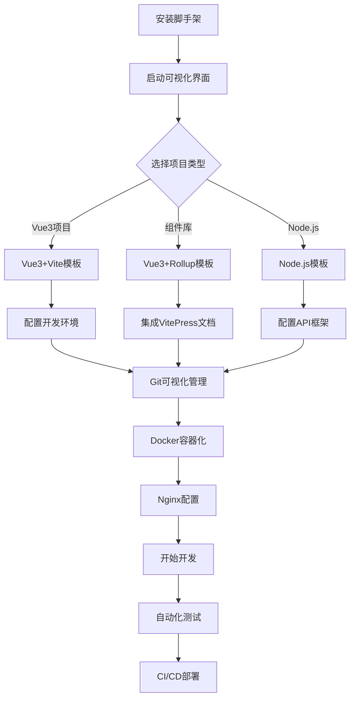

# Node.js 企业级脚手架项目需求文档

## 1. 产品概述

本项目旨在创建一个功能完整的企业级Node.js脚手架生成器，帮助开发者快速创建和定制自己的项目脚手架。该脚手架不仅涵盖现代Node.js开发的所有基础功能，还集成了Vue3项目模板、组件库开发、Git可视化操作、Docker容器化、Nginx配置等企业级开发工具，基于TypeScript开发，使用现代化的工具链进行构建、测试和文档生成。

项目的核心价值在于提供一个标准化、可扩展、企业级的全栈脚手架解决方案，大幅提升开发者的项目初始化效率、开发体验和代码质量，支持从项目创建到部署的完整开发生命周期。

## 2. 核心功能

### 2.1 用户角色

| 角色 | 使用方式 | 核心权限 |
|------|----------|----------|
| 开发者 | 通过npm安装使用 | 可以创建、配置和定制脚手架项目 |
| 贡献者 | 通过GitHub参与开发 | 可以提交代码、测试用例和文档改进 |

### 2.2 功能模块

本项目包含以下核心页面和功能模块：

1. **脚手架核心类**：提供项目创建、模板管理、配置生成等核心功能
2. **项目模板管理**：Vue3项目模板、Vue3组件库模板、通用Node.js模板
3. **构建工具集成**：Vite构建配置、Rollup打包配置、tsup打包配置
4. **Git可视化操作**：Git基础操作、GitHub工作流管理、Git Submodule管理
5. **开发环境管理**：本机开发工具检测、IDE自动启动、环境配置
6. **容器化支持**：Docker可视化界面、容器管理、镜像构建
7. **服务器配置**：Nginx可视化配置、反向代理设置、SSL配置

### 2.3 页面详情

| 页面名称 | 模块名称 | 功能描述 |
|----------|----------|----------|
| 脚手架核心类 | ScaffoldGenerator | 创建项目结构、生成配置文件、管理依赖包、处理模板文件、代码复用架构设计 |
| 脚手架核心类 | TemplateManager | 管理Vue3项目模板、Vue3组件库模板、自定义模板、模板变量替换 |
| 脚手架核心类 | ConfigGenerator | 生成TypeScript配置、ESLint配置、Prettier配置、Git配置、构建工具配置 |
| 项目模板管理 | Vue3项目模板 | 生成Vue3+Vite项目结构、路由配置、状态管理、UI组件库集成 |
| 项目模板管理 | Vue3组件库模板 | 生成组件库项目结构、Rollup打包配置、VitePress文档自动集成、组件开发规范 |
| 项目模板管理 | 通用Node.js模板 | 生成Node.js项目结构、Express/Koa框架集成、数据库配置、API文档 |
| 构建工具集成 | Vite构建配置 | 配置Vite开发服务器、热更新、插件系统、环境变量管理 |
| 构建工具集成 | Rollup打包配置 | 配置组件库打包、Tree-shaking、多格式输出、外部依赖处理 |
| 构建工具集成 | tsup打包配置 | 配置TypeScript打包、代码分割、压缩优化、类型声明生成 |
| Git可视化操作 | Git基础操作 | 可视化界面进行拉取、提交、推送、分支管理、合并操作 |
| Git可视化操作 | GitHub工作流 | 可视化创建和管理GitHub Actions、CI/CD流程、自动化部署 |
| Git可视化操作 | Submodule管理 | 可视化新增、编辑、删除Git子模块、依赖关系管理 |
| 开发环境管理 | 开发工具检测 | 自动检测本机VSCode、WebStorm等IDE、选择性启动开发环境 |
| 开发环境管理 | 环境配置 | 自动配置开发环境变量、数据库连接、API密钥管理 |
| 开发环境管理 | 测试工具集成 | 免安装集成Jest、Vitest、Cypress、Playwright等测试工具 |
| 容器化支持 | Docker界面 | 可视化Docker容器管理、镜像构建、容器编排、日志查看 |
| 容器化支持 | 容器配置 | 生成Dockerfile、docker-compose.yml、多环境配置 |
| 服务器配置 | Nginx界面 | 可视化Nginx配置管理、反向代理设置、负载均衡配置 |
| 服务器配置 | SSL配置 | 自动化SSL证书配置、HTTPS重定向、安全头设置 |
| 扩展功能 | Iconfont集成 | 图标字体管理、自动下载、项目集成、图标预览 |
| 扩展功能 | Fontmin优化 | 字体文件压缩、子集化、格式转换、性能优化 |

## 3. 核心流程

### 开发者使用流程
1. 安装脚手架工具包
2. 运行脚手架命令启动可视化界面
3. 选择项目类型（Vue3项目/Vue3组件库/Node.js项目）
4. 配置项目选项和构建工具
5. 自动生成完整的项目结构和配置
6. 检测并启动本机开发工具
7. 开始开发、测试和部署

### Vue3项目开发流程
1. 选择Vue3项目模板
2. 配置Vite构建和开发环境
3. 集成路由、状态管理和UI组件库
4. 使用可视化Git工具进行版本控制
5. 配置Docker容器化部署
6. 设置Nginx反向代理和SSL

### Vue3组件库开发流程
1. 选择Vue3组件库模板
2. 配置Rollup打包和TypeScript
3. 自动集成VitePress文档系统
4. 使用可视化测试工具验证组件
5. 配置GitHub Actions自动发布
6. 集成Iconfont和字体优化工具

## 4. 用户界面设计

### 4.1 设计风格
- **主色调**：#2563eb (蓝色) 和 #10b981 (绿色)
- **辅助色**：#6b7280 (灰色)、#f59e0b (橙色)、#ef4444 (红色)
- **按钮样式**：现代化圆角按钮，支持悬停和点击动效
- **字体**：Inter字体，代码使用JetBrains Mono，中文使用思源黑体
- **布局风格**：现代化卡片布局，可视化仪表板设计，响应式设计
- **图标风格**：使用Heroicons和Lucide图标库，支持自定义图标
- **动画效果**：流畅的过渡动画，加载动画，状态反馈动画

### 4.2 页面设计概览

| 页面名称 | 模块名称 | UI元素 |
|----------|----------|--------|
| 脚手架核心类 | 可视化界面 | 项目类型选择卡片、配置向导、进度指示器、实时预览 |
| 项目模板管理 | 模板选择器 | 模板卡片网格、预览窗口、配置表单、依赖关系图 |
| 构建工具集成 | 构建配置面板 | 配置选项卡、实时构建日志、性能监控图表 |
| Git可视化操作 | Git管理界面 | 分支树状图、提交历史时间线、文件变更对比、操作按钮组 |
| 开发环境管理 | 环境检测面板 | IDE检测状态、环境变量编辑器、工具启动按钮 |
| 容器化支持 | Docker管理界面 | 容器状态卡片、镜像列表、日志查看器、资源监控图表 |
| 服务器配置 | Nginx配置界面 | 配置文件编辑器、语法高亮、配置验证、重启控制 |
| 扩展功能 | 工具集成面板 | 图标预览网格、字体优化进度条、批量操作界面 |

### 4.3 响应式设计
项目采用桌面优先的设计策略，主要面向开发者的桌面环境使用。可视化界面支持多屏幕显示，侧边栏可折叠，支持暗色主题切换。移动端提供简化版本，主要用于查看状态和执行简单操作。